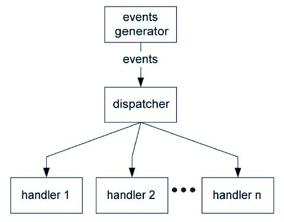

**ALGORITMOS Y ESTRUCTURAS DE DATOS**

**Guía 7. Consolidación de Networking y Event-Driven Programming**

**Para entregar:**

Basado en el TP5 (Máquina de estados) se pide implementar un cliente
y un servidor de TFTP usando los conceptos de Event-Driven
Programming vistos en el TP4 (Worms) y los conceptos de Networking
vistos en el TP6.

Utilizaremos las máquinas de estados creadas en el TP5 como Dispatcher y las funciones de transferencia (o acciones) como Handlers (recordando el esquema Event Generator - Dispatcher - Handler):

Nótese que las FSM como Dispatchers tiene una característica muy particular y esta es que nos brindan la posibilidad de responder
distinto ante el mismo evento (por responder en Event-driven Programming entendemos invocar a distintos Handlers ante el mismo
evento).

Dado que el Dispatcher ya está programado, el problema se reduce a establecer la comunicación entre el cliente y el servidor y luego
crear distintos Event Generators capaces de generar los eventos que definimos en el TP6 y que serán inputs del Dispatcher (implementado
como FSM) y funciones transferencia (Handlers) que realicen las acciones del TFTP. Puede ser necesario crear un Software Event Generator.

No es requisito que se limiten a utilizar los eventos y estados definidos en el TP6. Si se identificara que faltó algún evento o
estado se puede agregar. Se aprecia que las modificaciones sean mínimas pero se va a priorizar la madurez del código por sobre el
nivel de modificaciones que se le genere a la FSM del TP6.

Se utilizará el protocolo TCP/IP (aunque el TFTP fue creado para UDP) y el puerto 69 como puerto TFTP. Se debe ignorar el algoritmo para
determinar el puerto que se encuentra en la RFC1350. Simplemente utilizaremos el puerto 69 siempre.

Al ejecutar el server este deberá indicarle al usuario que está esperando una conexión así como todo lo que ocurre (momento en el que el
cliente se conecta, lo que el cliente realiza, como responde, etc). Se le debe dar la posibilidad al usuario de cancelar la operación y salir del programa en cualquier momento (no importa en qué estadío se encuentre el server). Una vez que el server terminó de recibir o enviar un archivo, se mantiene conectado esperando una nueva acción del cliente, hasta que el cliente se desconecte o el usuario elija cerrarlo.

El cliente recibe por línea de comando la dirección IP del servidor. Intenta conectarse y una vez conectado se lo indica al usuario y espera input de él.

El usuario ingresará uno de cuatro comandos al cliente:

>-   PUT &lt;NOMBRE DE ARCHIVO&gt;. Permite enviarle el archivo indicado
>    al server
>
>-   GET &lt;NOMBRE DE ARCHIVO&gt;. Permite recibir el archivo indicado
>    del server
>
>-   QUIT. Permite salir del programa y desconectarse del server
>
>-   HELP. Le muestra al usuario cómo usar le programa y sus opciones.

Al igual que con el server, el usuario del cliente debe poder salir del programa en cualquier momento independientemente de la operación que se esté realizando.

Tanto el cliente como el servidor en el caso en el que reciban un archivo procederán a guardarlo en un subdirectorio llamado “Download”
que se encontrará en el mismo directorio en donde se encuentra el programa.

Si el usuario le indicara al cliente que tienen que enviar un archivo inexistente este le responderá que dicho archivo no existe y esperará un nuevo input.

Si el cliente requiriera un archivo inexistente del servidor este le responderá con un error tal como se especifica en la RFC1350.

Una vez que terminó la transacción el cliente se mantendrá conectado al servidor hasta que el servidor se desconecte o el usuario elijar la opción de salir.

Cada paquete se encuentra especificado en la RFC1350 al igual que las condiciones que indican que se terminó la transferencia de datos.

Tanto el cliente como el servidor pueden recibir un paquete de error. Tal como dice la norma, al recibir dicho paquete se interrumpirá la transferencia pero ambos programas se mantendrán conectados. Tanto quien haya mandado el paquete ERROR como quien lo haya recibido le indicará al usuario que hubo un error y volverá a la condición inicial (cliente y servidor conectados, cliente esperando input de usuario, servidor esperando input del cliente).

Vamos a tomar 1 minuto como timeout de retransmisión.
